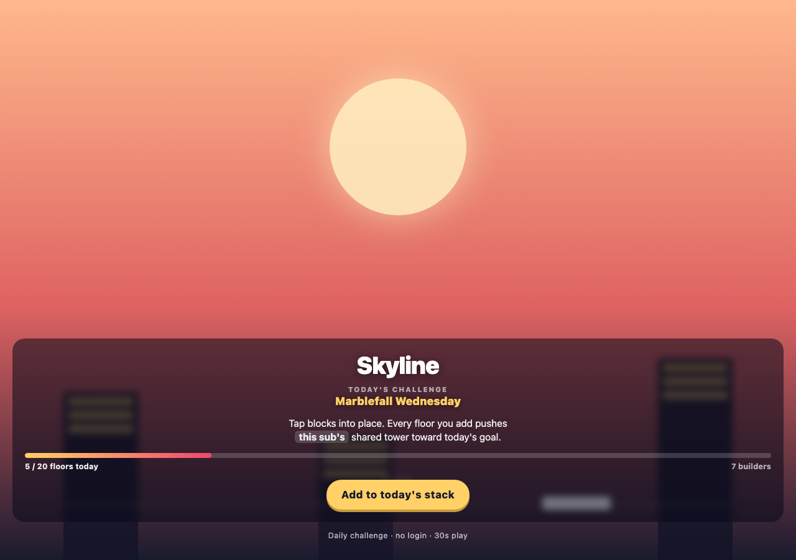
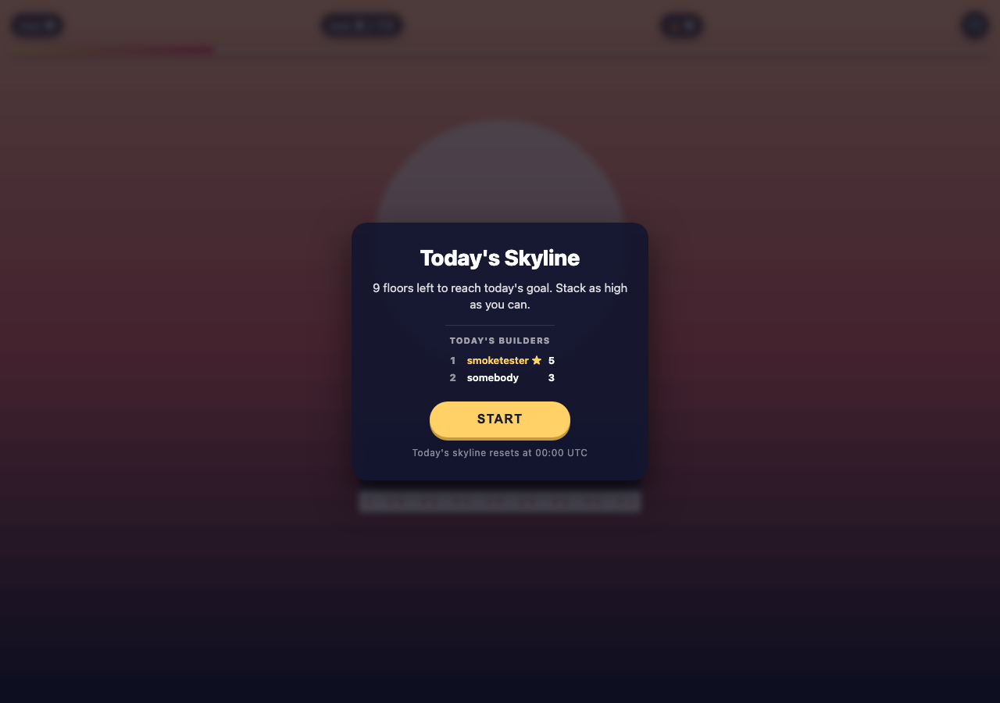
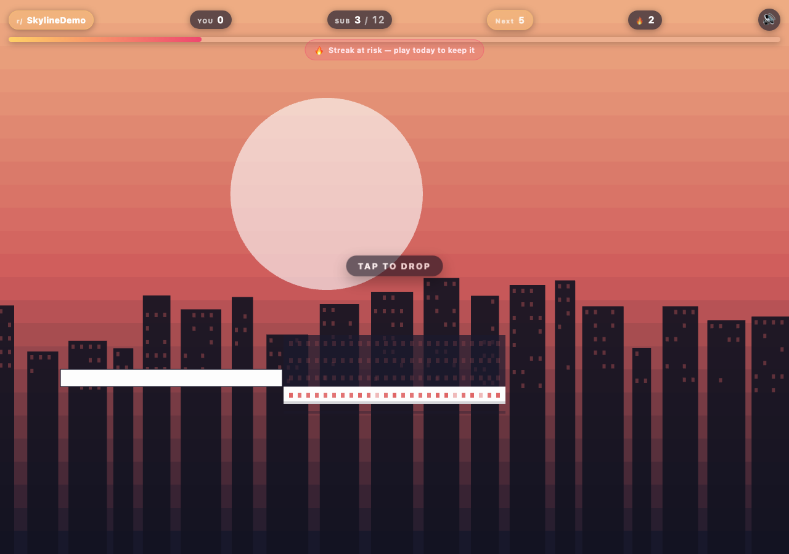
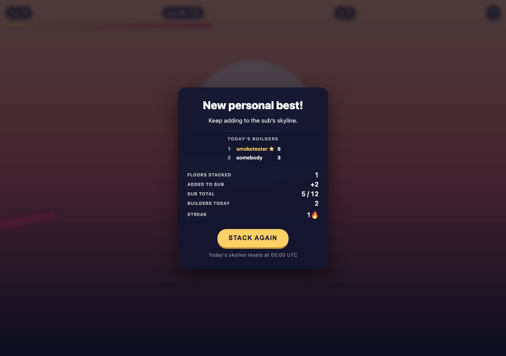
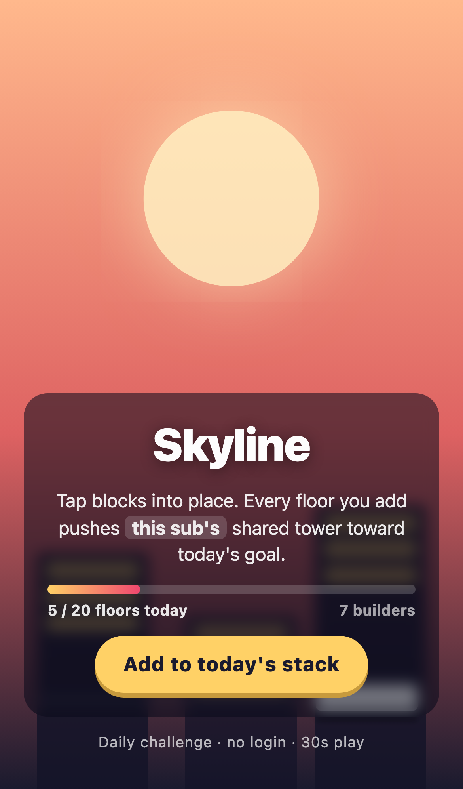
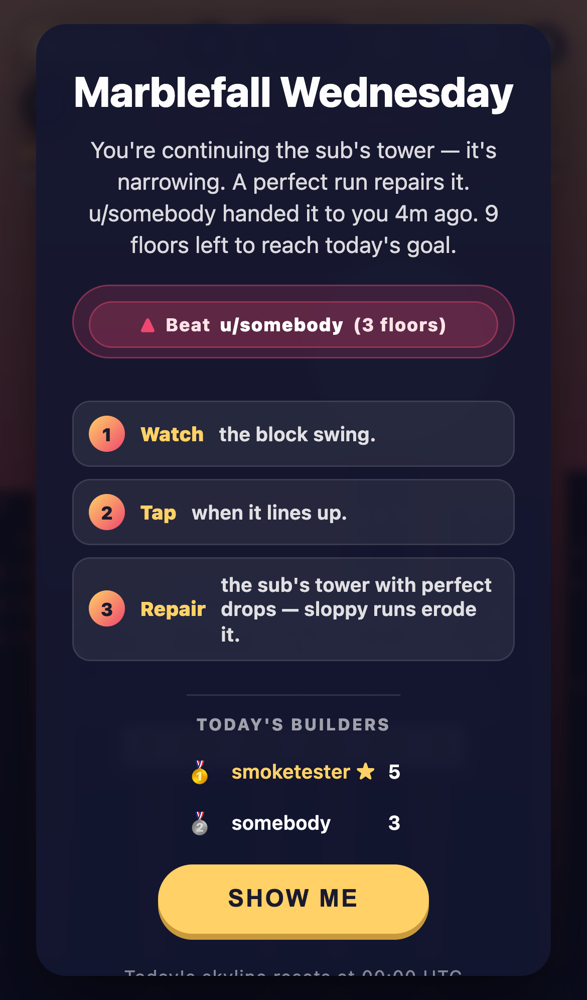
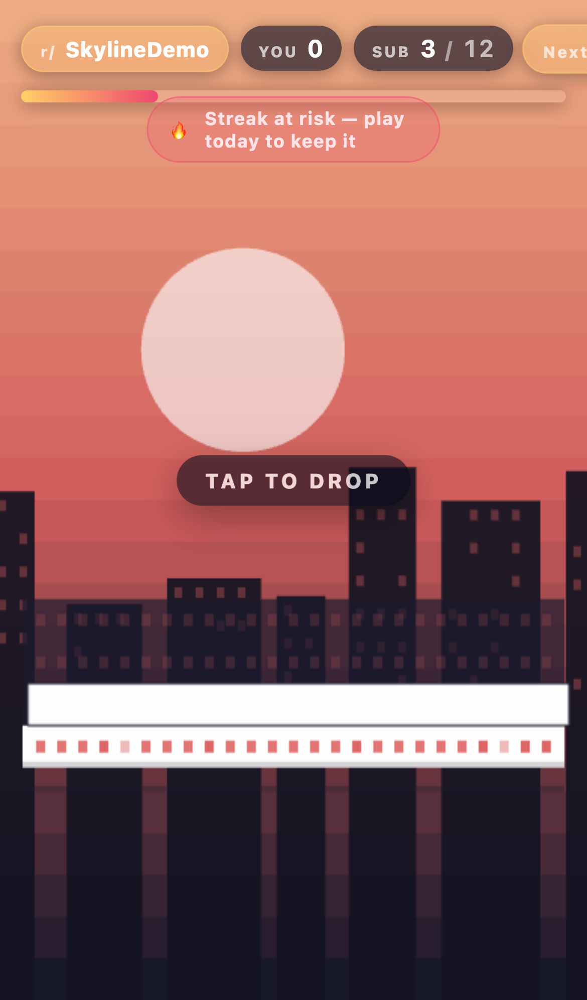
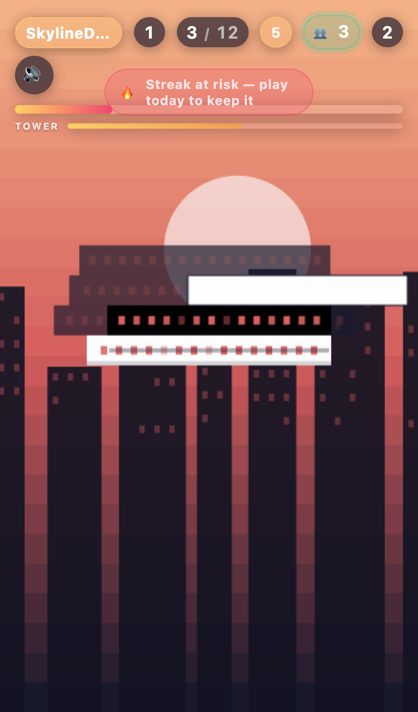

# Skyline — Subreddit Stack

Drop blocks to build today's skyline — every player in the sub adds a floor, and together you reach the goal.

Built for [Reddit's Games with a Hook Hackathon](https://redditgameswithahook.devpost.com/).

## Screenshots

| Splash | Start | Playing | After drop |
|---|---|---|---|
|  |  |  |  |
|  |  |  |  |

## How to play

1. Open a Skyline post in a participating subreddit.
2. Tap **Start today's stack** to expand into the game.
3. Tap (or press Space) to drop each swinging block.
4. Stack as many floors as you can — every floor you place is added to your sub's shared tower for today.
5. When the sub's tower hits the daily goal, tomorrow's palette unlocks for everyone.

A run takes 20–60 seconds. Perfect stacks (zero overhang) trigger a gold burst, a rising chime, and the next block grows slightly — chaining perfect runs is the meta. A mute toggle sits in the HUD.

## Why it has a hook

- **One-sentence hook**: every player in the sub builds one shared tower, hand to hand — you continue from exactly where the last builder left it, and together you reach the goal.
- **One shared physical tower**: the sub reshapes a single tower across the day. Your run's starting block width is whatever the sub's tower currently sits at — ordinary runs erode it toward a razor-thin minimum, and a **perfect run repairs it**, widening the top back out for everyone. Sloppy play hands the next builder a harder game; clean play is a gift to the sub. The ghost tower renders the day's *real* width history, so every post is a community-carved silhouette — pinched where the sub fumbled, swelling where someone went flawless. A TOWER integrity meter in the HUD and a "u/X handed it to you 4m ago" line keep the hand-to-hand story visible even for the first builder of the morning. All reshaping is computed server-side from accepted floors (never trusted from the client), clamped to a playable range, capped per run in both directions, and reset daily.
- **Live, in real time**: every run is broadcast on the post's Devvit realtime channel, so everyone else in the post watches the shared bar tick, the tower erode or get repaired, and a "u/name +N" chip pop in a live feed — plus a "👥 N building now" presence pill. Two redditors on the same post build it together at the same moment. The client is receive-only and the path is best-effort, so it never affects a run.
- **Daily reset**: the seed (palette, swing speed, goal) is locked for the UTC day, so everyone in the sub gets the same challenge.
- **Visible community progress**: the inline post card *and* the in-game HUD show a live bar toward today's floor goal, plus how many builders have contributed. You are not just chasing a personal best — you are helping the sub's skyline.
- **Today's builders board**: the end-of-run overlay (and the start overlay) shows the day's top contributors, with you highlighted and perfect runs starred.
- **Milestone floor tags**: the first player to cross each 5-floor milestone claims it and can tag it with a curated label such as Apex, Beacon, or Rally. The label renders on the shared tower for the sub.
- **Constrained contribution**: every run contributes `(username, floors, perfect)` plus optional curated floor tags. There is no arbitrary free-form text surface.

## Why it is Reddit-native

- Shared post state — every player in the same post shares one skyline, with Redis keys scoped by post id so different posts/subreddits do not leak into each other.
- Subreddit-scoped leaderboard (`/api/leaderboard`).
- No external client requests. The Phaser client only talks to `/api/*` on the Devvit server. The server is the only thing that touches Reddit's APIs.
- `requestExpandedMode(e, 'game')` from the splash, so the game plays inside the Reddit webview.
- No login, no posting, no commenting, no voting required. Players contribute just by playing.
- Moderator-only post action clears today's visible floor tags if the contribution surface ever needs removal.

## Retention mechanic

- Daily seed (UTC) — new challenge every day at 00:00 UTC.
- Streak counter computed server-side: consecutive UTC days with a stacked floor increment it; skipping a day resets it to 1. The count is derived from the stored last-play date, so it can't be spoofed by the client.
- Daily personal best, so the leaderboard stays fair.
- Daily community goal — when the bar fills, tomorrow's palette unlocks.
- Lifetime achievements for first stack, perfect-run mastery, 7-day streak, and 50 lifetime floors.

## User contribution mechanic

Every run submits `(username, floors, perfect)` to Redis with a short-lived server-issued run token. The server caps implausible floor counts before they affect the shared tower, leaderboard, achievements, or goal. Each player is one entry in a per-post, per-day sorted set scored by their best floors for the day, so the board dedupes by user. Milestone floors are claimed by the first player to cross them; owners can choose one curated label from a server-approved list, and that label is rendered on the shared tower. The top 10 are returned in the init/submit responses (and via `/api/leaderboard`) and surfaced on the start and end overlays, with the current user highlighted and perfect runs starred. Daily gameplay keys carry a 36h Redis TTL, so community contributions are short-lived; persistent player data is limited to streaks, lifetime counters, and achievements.

## Tech stack

- Devvit Web (custom post, `splash.html` + `game.html` entrypoints).
- Phaser 4 for game feel, scenes, tweens, particles, camera.
- Hono server with `@devvit/web` for `/api/*`, `/internal/menu/*`, and `/internal/triggers/*`.
- Devvit realtime for live, in-the-moment tower updates across every player in a post.
- Redis for daily seed state, per-user streaks, personal bests, milestone ownership, achievements, and presence.
- Vite for the client/server build.
- TypeScript across `src/client`, `src/server`, `src/shared`.
- Pure CSS for HUD/splash — no Tailwind, no asset CDN.

## Local development

Prereqs: Node 22.2+.

```bash
npm install
npm run harness:check   # quick sanity
npm run build           # produces dist/client + dist/server
npm run type-check      # tsc --build
npm run lint            # eslint
```

`npm run dev` runs `devvit playtest`, which spawns a test subreddit on Reddit. It requires `npm run login` first (opens Reddit OAuth in your browser).

## Devvit features used

- Custom post with two entrypoints: `splash.html` (default) and `game.html` (expanded).
- Server endpoints under `/api/*` (Hono) and `/internal/*` (menu, triggers).
- `realtime` for live tower broadcasts (server publishes on each submit; client subscribes receive-only).
- `redis` for state, `reddit.getCurrentUsername()` for attribution.
- Menu item: moderators can start a fresh skyline post.
- Moderator post action: clear today's floor tags from a Skyline post.
- Trigger: `onAppInstall` creates the initial post.

## Known limitations

- The game requires the Devvit server. There is no offline/degraded mode: if `/api/init` or `/api/submit` fails, the player sees an explicit error overlay with a retry button rather than fabricated state.
- No mid-game save — once you miss, the run is over.
- Audio is synthesized at runtime with the Web Audio API (no asset files). The mute preference is stored in `localStorage`; all durable game state lives in Redis.
- Daily seed keys are UTC dates. Players in very late or very early timezones may see two different "todays" within 24h; this is intentional for global fairness.
